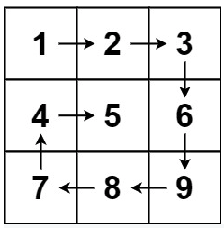
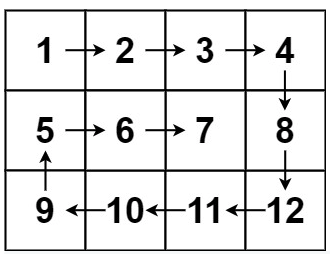
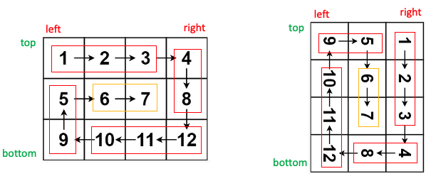

## Problem

Given an `m x n` `matrix`, return *all elements of the* `matrix` *in spiral order*.

 

**Example 1:**



```
Input: matrix = [[1,2,3],[4,5,6],[7,8,9]]
Output: [1,2,3,6,9,8,7,4,5]
```

**Example 2:**



```
Input: matrix = [[1,2,3,4],[5,6,7,8],[9,10,11,12]]
Output: [1,2,3,4,8,12,11,10,9,5,6,7]
```

## The Way of Thinking

1. high level idea: **iteration **

   

2. 因为是N*M的矩阵

   1. 当top == bottom 或者 left == right的时候,退出循环
   2. 进行post-processing


3. while (left < right && top < bottom)
4. post-processing

##  Solution

```java
class Solution {
    public List<Integer> spiralOrder(int[][] matrix) {
        List<Integer> result = new ArrayList<>();
        if (matrix == null || matrix.length == 0) {
            return result;
        }
        int left = 0;
        int right = matrix[0].length - 1;
        int top = 0;
        int bottom = matrix.length - 1;
        
        while (left < right && top < bottom) {
            for (int i = left; i < right; i++) {
                result.add(matrix[top][i]);
            }
            for (int i = top; i < bottom; i++) {
                result.add(matrix[i][right]);
            }
            for (int i = right; i > left; i--) {
                result.add(matrix[bottom][i]);
            }
            for (int i = bottom; i > top; i--) {
                result.add(matrix[i][left]);
            }
            left++;
            right--;
            top++;
            bottom--;
        }
        
        //post processing
        if (left == right) {
            for (int i = top; i <= bottom; i++) {
                result.add(matrix[i][left]);
            }
        } else if (top == bottom) {
            for (int i = left; i <= right; i++) {
                result.add(matrix[top][i]);
            }
        }
        return result;
    }
}
```

end.