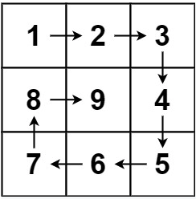

## Problem

Given a positive integer `n`, generate an `n x n` `matrix` filled with elements from `1` to `n2` in spiral order.

 

**Example 1:**



```
Input: n = 3
Output: [[1,2,3],[8,9,4],[7,6,5]]
```

**Example 2:**

```
Input: n = 1
Output: [[1]]
```


## The Way of Thinking

1. high level idea: **iteration **

2. 因为是N*N的矩阵

   1. 如果N = 3;  start = 0, end = 2;  -->  start = 1, end = 1,   **单独进行post-processing**
   2. 如果N = 4; start = 0, end = 3; --> start  = 1, end = 2; --> start = 2, end = 1


3. while (start < end)

##  Solution

```java
class Solution {
    public int[][] generateMatrix(int n) {
        int[][] matrix = new int[n][n];
        int k = 1;
        int start = 0;
        int end = n - 1;
        
        while (start < end) {
            for (int i = start; i < end; i++) {
                matrix[start][i] = k++;
            }
            for (int i = start; i < end; i++) {
                matrix[i][end] = k++;
            }
            for (int i = end; i > start; i--) {
                matrix[end][i] = k++;
            }
            for (int i = end; i > start; i--) {
                matrix[i][start] = k++;
            }
            start++;
            end--;
        }
        if (start == end) {
            matrix[start][end] = k;
        }
        return matrix;
    }
}
```

end.