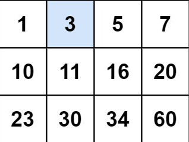

## Problem

Write an efficient algorithm that searches for a value in an `m x n` matrix. This matrix has the following properties:

- Integers in each row are sorted from left to right.
- The first integer of each row is greater than the last integer of the previous row.

**Example 1:**



```
Input: matrix = [[1,3,5,7],[10,11,16,20],[23,30,34,60]], target = 3
Output: true
```


## The Way of Thinking

1. high level idea: **Classical Binary Search **

   1. col  = mid / cols
2. row = mid % cols
   

## Solution

```java
class Solution {
    public boolean searchMatrix(int[][] matrix, int target) {
        if (matrix == null || matrix.length == 0) {
            return false;
        }
        int rows = matrix.length;
        int cols = matrix[0].length;
        int left = 0;
        int right = rows * cols - 1;
        while (left <= right) {
            int mid = left + (right - left) / 2;
            int row = mid / cols;
            int col = mid % cols;
            if (matrix[row][col] == target) {
                return true;
            } else if (matrix[row][col] < target) {
                left = mid + 1;
            } else {
                right = mid - 1;
            }
        }
        return false;
    }
}
```

end.