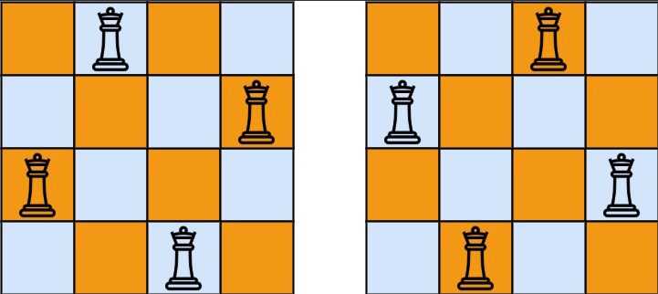

## Question:

The **n-queens** puzzle is the problem of placing `n` queens on an `n x n` chessboard such that no two queens attack each other.

Given an integer `n`, return *all distinct solutions to the **n-queens puzzle***.

Each solution contains a distinct board configuration of the n-queens' placement, where `'Q'` and `'.'` both indicate a queen and an empty space, respectively.

 

**Example 1:**



```
Input: n = 4
Output: [[".Q..","...Q","Q...","..Q."],["..Q.","Q...","...Q",".Q.."]]
Explanation: There exist two distinct solutions to the 4-queens puzzle as shown above
```

**Example 2:**

```
Input: n = 1
Output: [["Q"]]
```

## High Level Idea:

- depth first search
  
- creat a one dimension array to verify if the next is valid
  
  ```java
  /*
  [1,4,0,2]
  index represents row
  value of index represents col
    [ .  Q  .  .
      .  .  .  Q
      Q  .  .  .
      .  .  Q  . ]
    
    1. analysis diagonals slope 
    2. analysis if in same column 
  ```
  
- Complexity Analysis:
  - Time: O(n!)
  - Space: O(n)

## Simulation:

```java
/*
                                 (0,1)
                               /  |  |  \
                             x    x  x  (1,3)
                                      /  |  |  \
                                  (2,0)  x  x   x
                                /  |  |  \
                               x   x (3,2) x
                                       |
                                    base case
```


## **Solution:**

```java
class Solution {
    public List<List<String>> solveNQueens(int n) {
        List<List<String>> result = new ArrayList<>();
        List<Integer> cur = new ArrayList<>();
        helper(n, cur, result);
        return result;
    }
    
    private void helper(int n, List<Integer> cur, List<List<String>> result) {
        if (cur.size() == n) {
            result.add(toString(cur));
            return;
        }
        for (int i = 0; i < n; i++) {
            if (isValid(cur, i)) {
                cur.add(i);
                helper(n, cur, result);
                cur.remove(cur.size() - 1);
            }
        }
    }
    
    private boolean isValid(List<Integer> cur, int column) {
        int row = cur.size();
        for (int i = 0; i < row; i++) {
            if (cur.get(i) == column || Math.abs(cur.get(i) - column) == row - i) {
                return false;
            }
        }
        return true;
    }
    
    private List<String> toString(List<Integer> array) {
        List<String> result = new ArrayList<>();
        for (int i = 0; i < array.size(); i++) {
            StringBuilder sb = new StringBuilder();
            int num = array.get(i);
            for (int j = 0; j < array.size(); j++) {
                if (j == num) {
                    sb.append('Q');
                } else {
                    sb.append('.');
                }
            }
            result.add(sb.toString());
        }
        return result;
    }
}
```

end.