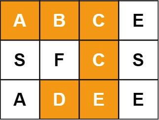
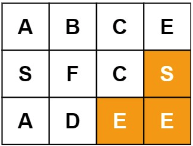
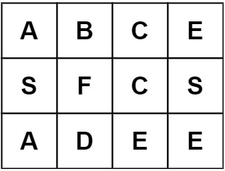

## Question:

Given an `m x n` `board` and a `word`, find if the word exists in the grid.

The word can be constructed from letters of sequentially adjacent cells, where "adjacent" cells are horizontally or vertically neighboring. The same letter cell may not be used more than once.

 

**Example 1:**



```
Input: board = [["A","B","C","E"],["S","F","C","S"],["A","D","E","E"]], word = "ABCCED"
Output: true
```

**Example 2:**



```
Input: board = [["A","B","C","E"],["S","F","C","S"],["A","D","E","E"]], word = "SEE"
Output: true
```

**Example 3:**



```
Input: board = [["A","B","C","E"],["S","F","C","S"],["A","D","E","E"]], word = "ABCB"
Output: false
```

## High Level Idea:

- DFS
- Complexity Analysis:
  - Time: O(m * n * 4^length)
  - Space: O(length of word)

## DFS **Solution:**

```java
class Solution {
    public boolean exist(char[][] board, String word) {
        int m = board.length;
        int n = board[0].length;
        for (int r = 0; r < m; r++) {
            for (int c = 0; c < n; c++) {
                if (board[r][c] == word.charAt(0)) {
                  //notic here
                    if (dfs(r, c, board, 0, word)) {
                        return true;
                    }
                }
            }
        }
        return false;
    }
    
    private boolean dfs(int r, int c, char[][] board, int index, String word) {
        if (index == word.length()) {
            return true;
        }
        
        if (r < 0 || c < 0 || r >= board.length || c >= board[0].length || board[r][c] != word.charAt(index)) {
            return false;
        }
        
        char temp = board[r][c];
        board[r][c] = '#';
        
        if (dfs(r + 1, c, board, index + 1, word)
           || dfs(r - 1, c, board, index + 1, word)
           || dfs(r, c + 1, board, index + 1, word) 
           || dfs(r, c - 1, board, index + 1, word)) {
            return true;
        }
        
        board[r][c] = temp;
        
        return false;
    }
}
```

end.
