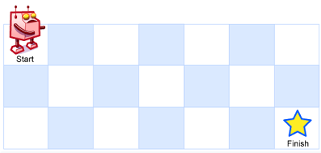

## Question:

A robot is located at the top-left corner of a `m x n` grid (marked 'Start' in the diagram below).

The robot can only move either down or right at any point in time. The robot is trying to reach the bottom-right corner of the grid (marked 'Finish' in the diagram below).

How many possible unique paths are there?

 

**Example 1:**



```
Input: m = 3, n = 7
Output: 28
```

**Example 2:**

```
Input: m = 3, n = 2
Output: 3
Explanation:
From the top-left corner, there are a total of 3 ways to reach the bottom-right corner:
1. Right -> Down -> Down
2. Down -> Down -> Right
3. Down -> Right -> Down
```

**Example 3:**

```
Input: m = 7, n = 3
Output: 28
```

## High Level Idea:

- Recursion with memo
  - subproblems:
    - A = f(m -1, n)
    - B = f(m, n - 1)
  - Recursion rule;
    - numbers of A + numbers of B
  - Base Case:
    - m == 0 or n == 0 --> return 0
    - m == 1 && n == 1 --> return 1
- Complexity Analysis:
  - Time: O(2^n), with memo O(n)
  - Space: O(m*n)

## Simulation:


```java
/*
                                     m,n
      															(3,2)
                                  /         \
                              (2,2)          (3,1)
                            /      \        /     \
                         (1,2)    (2,1)  (2,1)    (3,0)
                       /   \     /    \  /   \
                   (0,2) (1,1)(1,1)(2,0)(1,1) (2,0)
                   
                   base case:
                   1. m == 0 or n == 0 --> return 0
                   2. m == 1 && n == 1 --> return 1
```


## Recursion Solution With Memo:

```java
class Solution {
    public int uniquePaths(int m, int n) {
        int[][] memo = new int[m][n];
        return helper(m, n, memo);
    }
    
    private int helper(int m, int n, int[][] memo) {
        if (m == 0 || n == 0) {
            return 0;
        }
        if (m == 1 && n == 1) {
            return 1;
        }
        if (memo[m - 1][n - 1] == 0) {
            memo[m - 1][n - 1] = helper(m - 1, n, memo) + helper(m, n - 1, memo);
        }
        return memo[m - 1][n - 1];
    }
}
```

## DP Solution:

```java
class Solution {
    public int uniquePaths(int m, int n) {
        int[][] memo = new int[m][n];
        for (int[] array : memo) {
            Arrays.fill(array, 1);
        }
        // set row = 1, col = 1 to avoid the corner case
      // because the most top row and the most left col were filled with 1
        for (int row = 1; row < m; row++) {
            for (int col = 1; col < n; col++) {
                memo[row][col] = memo[row - 1][col] + memo[row][col - 1]; 
            }
        }
        return memo[m - 1][n - 1];
    }
}
```

end.