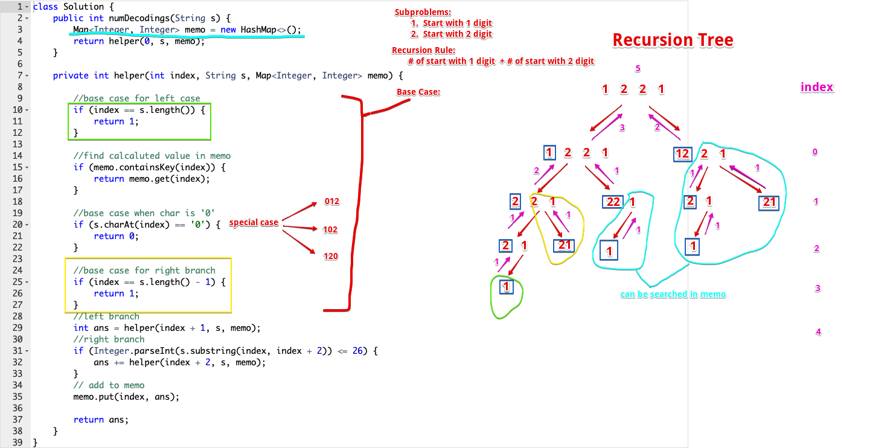

## Question:

A message containing letters from `A-Z` can be **encoded** into numbers using the following mapping:

```
'A' -> "1"
'B' -> "2"
...
'Z' -> "26"
```

To **decode** an encoded message, all the digits must be mapped back into letters using the reverse of the mapping above (there may be multiple ways). For example, `"111"` can have each of its `"1"`s be mapped into `'A'`s to make `"AAA"`, or it could be mapped to `"11"` and `"1"` (`'K'` and `'A'` respectively) to make `"KA"`. Note that `"06"` cannot be mapped into `'F'` since `"6"` is different from `"06"`.

Given a **non-empty** string `num` containing only digits, return *the **number** of ways to **decode** it*.

The answer is guaranteed to fit in a **32-bit** integer.

 

**Example 1:**

```
Input: s = "12"
Output: 2
Explanation: "12" could be decoded as "AB" (1 2) or "L" (12).
```

**Example 2:**

```
Input: s = "226"
Output: 3
Explanation: "226" could be decoded as "BZ" (2 26), "VF" (22 6), or "BBF" (2 2 6).
```

**Example 3:**

```
Input: s = "0"
Output: 0
Explanation: There is no character that is mapped to a number starting with 0. The only valid mappings with 0 are 'J' -> "10" and 'T' -> "20".
Since there is no character, there are no valid ways to decode this since all digits need to be mapped.
```

**Example 4:**

```
Input: s = "06"
Output: 0
Explanation: "06" cannot be mapped to "F" because the zero at the beginning of the string can't make a valid character. 
```

## High Level Idea:

- Recursion
  - subproblems:
    - A: start with 1 digit
    - B: start with 2 digit
  - Recursion rule;
    - numbers of A + numbers of B
  - Base Case:
    - start with 1 digit
    - start with 2 digit
    - char is "0"
- Complexity Analysis:
  - Time: O(2^n), with memo O(n)
  - Space: O(n)

## Simulation:



## Recursion Solution:

```java
class Solution {
    public int numDecodings(String s) {
        Map<Integer, Integer> memo = new HashMap<>();
        return helper(0, s, memo);
    }
    
    private int helper(int index, String s, Map<Integer, Integer> memo) {
        
        //base case for left case
        if (index == s.length()) {
            return 1;
        }
        
        //find calcaluted value in memo
        if (memo.containsKey(index)) {
            return memo.get(index);
        }
        
        //base case when char is '0'
        if (s.charAt(index) == '0') {
            return 0;
        }
        
        //base case for right branch
        if (index == s.length() - 1) {
            return 1;
        }
        //left branch
        int ans = helper(index + 1, s, memo);
        //right branch
        if ((s.charAt(index) - '0') * 10 + (s.charAt(index + 1) - '0') <= 26) {
            ans += helper(index + 2, s, memo);
        }
        // add to memo
        memo.put(index, ans);
        
        return ans;
    }
}
```

## DP Solution:

